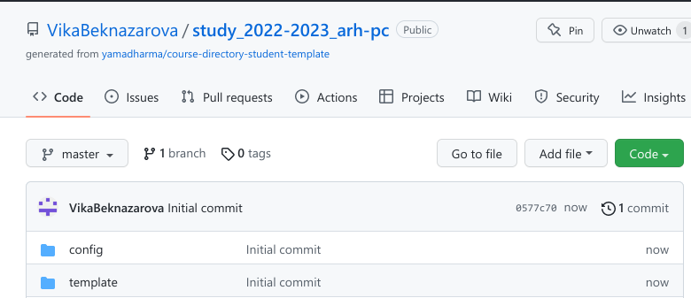

---
## Front matter
title: "Лабораторная работа №2"
subtitle: "Архитектура вычислительных систем"
author: "Виктория Тиграновна Бекназарова"

## Generic otions
lang: ru-RU
toc-title: "Содержание"

## Bibliography
bibliography: bib/cite.bib
csl: pandoc/csl/gost-r-7-0-5-2008-numeric.csl

## Pdf output format
toc: true # Table of contents
toc-depth: 2
lof: true # List of figures
lot: true # List of tables
fontsize: 12pt
linestretch: 1.5
papersize: a4
documentclass: scrreprt
## I18n polyglossia
polyglossia-lang:
  name: russian
  options:
	- spelling=modern
	- babelshorthands=true
polyglossia-otherlangs:
  name: english
## I18n babel
babel-lang: russian
babel-otherlangs: english
## Fonts
mainfont: PT Serif
romanfont: PT Serif
sansfont: PT Sans
monofont: PT Mono
mainfontoptions: Ligatures=TeX
romanfontoptions: Ligatures=TeX
sansfontoptions: Ligatures=TeX,Scale=MatchLowercase
monofontoptions: Scale=MatchLowercase,Scale=0.9
## Biblatex
biblatex: true
biblio-style: "gost-numeric"
biblatexoptions:
  - parentracker=true
  - backend=biber
  - hyperref=auto
  - language=auto
  - autolang=other*
  - citestyle=gost-numeric
## Pandoc-crossref LaTeX customization
figureTitle: "Рис."
tableTitle: "Таблица"
listingTitle: "Листинг"
lofTitle: "Список иллюстраций"
lotTitle: "Список таблиц"
lolTitle: "Листинги"
## Misc options
indent: true
header-includes:
  - \usepackage{indentfirst}
  - \usepackage{float} # keep figures where there are in the text
  - \floatplacement{figure}{H} # keep figures where there are in the text
---

# Цель работы

Целью работы является изучить идеологию и применение средств контроля
версий. Приобрести практические навыки по работе с системой git.

# Задание

1. Создайте отчет по выполнению лабораторной работы в соответствующем
каталоге рабочего пространства (labs>lab03>report).
2. Скопируйте отчеты по выполнению предыдущих лабораторных работ в
соответствующие каталоги созданного рабочего пространства.
3. Загрузите файлы на github.

# Выполнение лабораторной работы

1. Сначала сделаем предварительную конфигурацию git. 

{ #fig:001 width=95% }

2. Настроим utf-8 в выводе сообщений git:

{ #fig:002 width=95% }

3. Зададим имя начальной ветки (будем называть её master)

{ #fig:003 width=95% }

4. Параметр autocrlf:

{ #fig:004 width=95% }

5. Параметр safecrlf:

{ #fig:005 width=95% }

6. Для последующей идентификации пользователя на сервере репозиториев необходимо сгенерировать пару ключей (приватный и открытый):

{ #fig:006 width=95% }

7. загружаем сгенерённый открытый ключ. Заходим насайт http://github.org/  переходим в меню Setting . Выбираем в боковом меню SSH and GPG keys и нажимаем кнопку New SSH key .Скопировав ключ в буфер обмена

{ #fig:007 width=95% }

8. вставляем ключ в появившееся на сайте поле и указываем для ключа имя

{ #fig:008 width=95% }

9. создаем каталог для предмета «Архитектура компьютера»

{ #fig:009 width=95% }

10. Репозиторий можно создать через web-интерфейс github.В открывшемся окне задаем имя репозитория (Repository name)study_2022–2023_arh-pc и создайте репозиторий .

{ #fig:0010 width=95% }

11. Откроем терминал и перейдем в каталог курса

{ #fig:0011 width=95% }

12. Клонируем созданный репозиторий

{ #fig:0012 width=95% }

13. Переходим в каталог курса и удаляем лишние файлы

{ #fig:0013 width=95% }

14. Создаем необходимые каталоги

{ #fig:0014 width=95% }

15. Отправим файлы на сервер при помощи команд git add и git commit

{ #fig:0015 width=95% }

16. Отправим файлы на сервер при помощи команды git push

{ #fig:0016 width=95% }

17. Проверим правильность создания иерархии 

{#fig:0017 width=95%}

{#fig:0018 width=95%}

# Самостоятельная работа 

Копируем отчёты выполнения лабораторных работ в соответствующие каталоги созданного пространства и загружаем на https://github.com/VikaBeknazarova/study_2022-2023_arh-pc 

# Выводы

Я приобрела практические навыки в работе с системой git и изучила идеологию и
применение средств контроля версий.

